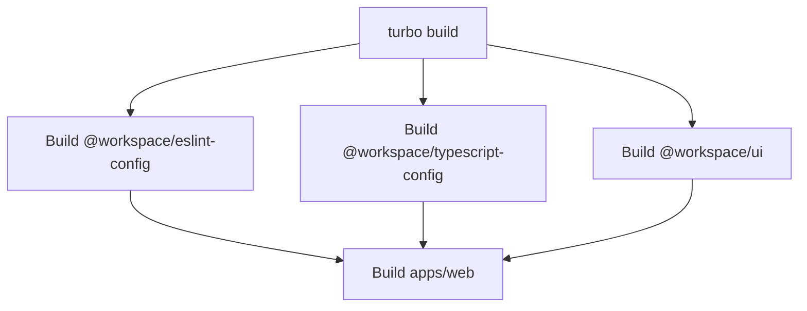

The AdonisJS Starter Kit uses a monorepo architecture powered by **TurboRepo** and **pnpm workspaces** to manage multiple packages and applications efficiently.

## Why Monorepo?

A monorepo structure provides several benefits:

<CardGroup cols={2}>
  <Card title="Code Sharing" icon="share-nodes">
    Share components, utilities, and configurations across apps without publishing to npm
  </Card>
  
  <Card title="Atomic Changes" icon="atom">
    Make changes across multiple packages in a single commit
  </Card>
  
  <Card title="Consistent Tooling" icon="screwdriver-wrench">
    Use the same TypeScript, ESLint, and Prettier configs everywhere
  </Card>
  
  <Card title="Faster Builds" icon="rocket">
    TurboRepo caches build outputs and only rebuilds what changed
  </Card>
</CardGroup>

## pnpm Workspace Configuration

The monorepo is configured using pnpm workspaces, defined in `pnpm-workspace.yaml`:

```yaml pnpm-workspace.yaml
packages:
  - "apps/*"
  - "packages/*"
```

This tells pnpm to treat all directories under `apps/` and `packages/` as workspace members.

### Workspace Protocol

Packages can reference each other using the `workspace:*` protocol:

```json apps/web/package.json
{
  "dependencies": {
    "@workspace/ui": "workspace:*"
  }
}
```

<Info>
  The `workspace:*` protocol ensures you always use the local version of the package during development, and pnpm resolves it to the correct version when publishing.
</Info>

## TurboRepo Configuration

TurboRepo manages the build pipeline and caching. The configuration is in `turbo.json`:

```json turbo.json
{
  "$schema": "https://turbo.build/schema.json",
  "ui": "tui",
  "tasks": {
    "build": {
      "dependsOn": ["^build"],
      "inputs": ["$TURBO_DEFAULT$", ".env*"],
      "outputs": [".next/**", "!.next/cache/**", "build/**"]
    },
    "lint": {
      "dependsOn": ["^lint"]
    },
    "check-types": {
      "dependsOn": ["^check-types"]
    },
    "dev": {
      "cache": false,
      "persistent": true
    }
  }
}
```

### Understanding Tasks

<AccordionGroup>
  <Accordion title="build">
    **Purpose**: Compile TypeScript and build production assets
    
    - `dependsOn: ["^build"]`: Build dependencies first (packages before apps)
    - `inputs`: Include default files and `.env*` files in cache key
    - `outputs`: Cache the build artifacts for faster subsequent builds
    
    ```bash
    pnpm build  # Runs turbo build
    ```
  </Accordion>
  
  <Accordion title="lint">
    **Purpose**: Run ESLint across all workspaces
    
    - `dependsOn: ["^lint"]`: Lint dependencies first
    - Cached by default (runs instantly if nothing changed)
    
    ```bash
    pnpm lint  # Runs turbo lint
    ```
  </Accordion>
  
  <Accordion title="check-types">
    **Purpose**: Run TypeScript type checking
    
    - `dependsOn: ["^check-types"]`: Check dependencies first
    - Results are cached for faster checks
    
    ```bash
    turbo check-types
    ```
  </Accordion>
  
  <Accordion title="dev">
    **Purpose**: Start development servers
    
    - `cache: false`: Never cache dev server output
    - `persistent: true`: Keep the process running (don't exit after completion)
    
    ```bash
    pnpm dev  # Runs turbo dev
    ```
  </Accordion>
</AccordionGroup>

### Task Dependencies

The `^` prefix in `dependsOn` means "run this task on dependencies first":



<Tip>
  TurboRepo automatically determines the build order based on package dependencies in `package.json`.
</Tip>

## Root Package Configuration

The root `package.json` defines workspace-level scripts:

```json package.json
{
  "name": "adonisjs-starter-kit",
  "version": "0.0.2",
  "private": true,
  "scripts": {
    "build": "turbo build",
    "dev": "turbo dev",
    "lint": "turbo lint",
    "format": "prettier --write \"**/*.{ts,tsx,md}\"",
    "docker:prod": "docker compose -f docker-compose.yaml -f docker-compose.prod.yaml up -d"
  },
  "devDependencies": {
    "@workspace/eslint-config": "workspace:*",
    "@workspace/typescript-config": "workspace:*",
    "prettier": "^3.6.2",
    "turbo": "^2.5.8",
    "typescript": "~5.9.3"
  },
  "packageManager": "pnpm@10.18.0",
  "engines": {
    "node": ">=20"
  }
}
```

<Warning>
  The `packageManager` field locks the pnpm version. Make sure you have pnpm 10.18.0 or higher installed.
</Warning>

## Package Manager: pnpm

### Why pnpm?

pnpm offers several advantages over npm and yarn:

- **Disk Space Efficiency**: Packages are stored once in a global store, linked via symlinks
- **Speed**: Faster installation due to content-addressable storage
- **Strict Dependencies**: Prevents access to undeclared dependencies
- **Monorepo Support**: First-class workspace support

### Common pnpm Commands

<CodeGroup>
```bash Install dependencies
# Install all workspace dependencies
pnpm install

# Add a dependency to a specific workspace
pnpm add react --filter web

# Add a dev dependency to root
pnpm add -D prettier -w
```

```bash Run scripts
# Run dev in all workspaces
pnpm dev

# Run script in specific workspace
pnpm --filter web dev
pnpm --filter @workspace/ui build

# Run script in all workspaces
pnpm -r build  # -r = recursive
```

```bash Workspace commands
# List all workspace packages
pnpm list -r --depth 0

# Execute command in workspace
pnpm --filter web exec node ace migration:run

# Update dependencies
pnpm update -r  # Update all workspaces
```
</CodeGroup>

### pnpm Filtering

The `--filter` flag (or `-F`) runs commands in specific workspaces:

```bash
# By package name
pnpm --filter web dev
pnpm --filter @workspace/ui build

# By directory
pnpm --filter ./apps/web dev

# Multiple packages
pnpm --filter "./packages/*" build
```

<Info>
  Package names are defined in each workspace's `package.json`. The web app uses `"name": "web"`, so you filter with `--filter web`.
</Info>

## Build Caching

TurboRepo caches task outputs to speed up subsequent runs:

```bash
# First run - actually executes tasks
pnpm build
# >>> FULL TURBO ⏱  (takes 30s)

# Second run - uses cache
pnpm build
# >>> >>> FULL TURBO ✓ (instant, from cache)
```

### Cache Invalidation

TurboRepo automatically invalidates cache when:

- Source files change
- Dependencies change
- Environment variables change (if specified in `inputs`)
- Task configuration changes

### Force Rebuild

To bypass the cache and force a rebuild:

```bash
turbo build --force
```

## Workspace Organization

### Apps

The `apps/` directory contains **runnable applications**:

- **web**: Main AdonisJS application with Inertia.js frontend
- Future apps could include: API servers, admin dashboards, documentation sites, etc.

### Packages

The `packages/` directory contains **shared libraries**:

<Tabs>
  <Tab title="@workspace/ui">
    **Purpose**: Shared React components (ShadCN)
    
    ```json
    {
      "name": "@workspace/ui",
      "exports": {
        "./globals.css": "./src/styles/globals.css",
        "./lib/*": "./src/lib/*.ts",
        "./components/*": "./src/components/*.tsx",
        "./hooks/*": "./src/hooks/*.ts"
      }
    }
    ```
    
    Used in apps/web:
    ```typescript
    import { Button } from '@workspace/ui/components/button'
    import { cn } from '@workspace/ui/lib/utils'
    ```
  </Tab>
  
  <Tab title="@workspace/eslint-config">
    **Purpose**: Shared ESLint configurations
    
    ```json
    {
      "name": "@workspace/eslint-config",
      "exports": {
        "./base": "./base.js",
        "./adonis": "./adonis.app.js",
        "./next-js": "./next.js",
        "./react-internal": "./react-internal.js"
      }
    }
    ```
    
    Used in apps/web:
    ```javascript
    import { defineConfig } from '@workspace/eslint-config/adonis'
    ```
  </Tab>
  
  <Tab title="@workspace/typescript-config">
    **Purpose**: Shared TypeScript configurations
    
    ```json
    {
      "name": "@workspace/typescript-config",
      "dependencies": {
        "@adonisjs/tsconfig": "^1.4.1"
      }
    }
    ```
    
    Extended in apps/web:
    ```json
    {
      "extends": "@workspace/typescript-config/base.json"
    }
    ```
  </Tab>
</Tabs>

## Adding New Workspaces

### Creating a New App

```bash
# 1. Create directory
mkdir apps/admin
cd apps/admin

# 2. Initialize package.json
pnpm init

# 3. Update name
# Edit package.json: "name": "admin"

# 4. Install dependencies
pnpm install

# 5. Use shared packages
pnpm add @workspace/ui @workspace/eslint-config
```

### Creating a New Package

```bash
# 1. Create directory
mkdir packages/utils
cd packages/utils

# 2. Initialize package.json
pnpm init

# 3. Set name with @workspace scope
# Edit package.json: "name": "@workspace/utils"

# 4. Define exports
# Add "exports" field to package.json

# 5. Use in apps
cd ../../apps/web
pnpm add @workspace/utils
```

<Tip>
  After adding new workspaces, run `pnpm install` at the root to update the workspace links.
</Tip>

## Next Steps

<Card title="Modular Architecture" icon="puzzle-piece" href="/structure/modules">
  Learn how modules organize code within the web application
</Card>
